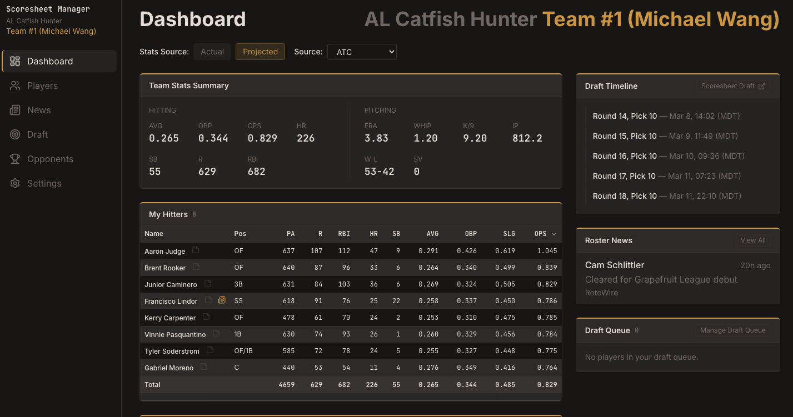
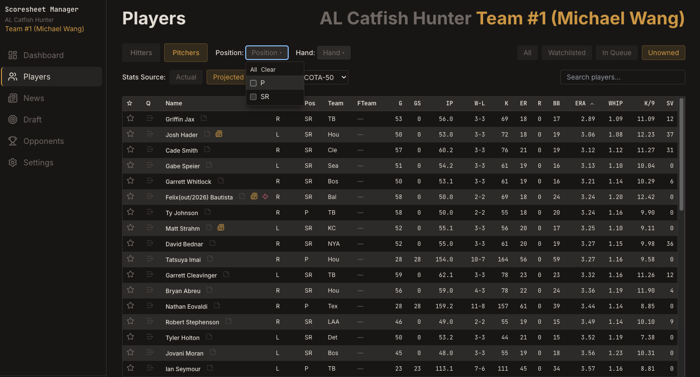
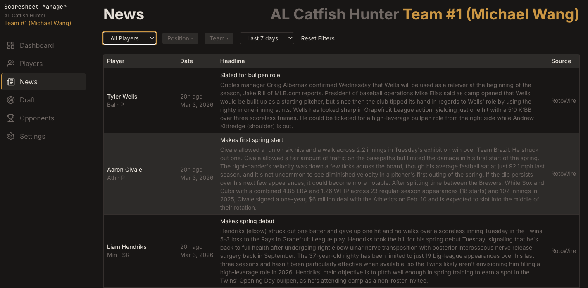

# Scoresheet Manager

Bloomberg terminal for fantasy baseball. Stat tracking, draft management, and roster tools for a 10-team Scoresheet league.

**`Next.js` + `TypeScript` | `FastAPI` + `PostgreSQL` | `Railway`**

1,580+ tests | 115+ PRs merged | 11 architecture docs

## What It Looks Like

<p>
  
  
  
</p>

*Dashboard | Players | News*

## Why I Built This

I play in a 10-team Scoresheet league with 3 championships in 6 years, going for 4 in 7. I was tired of jumping between spreadsheets, stat sites, and manual tracking to manage rosters and prep for drafts. So I built the tool I actually wanted: dense, fast, and opinionated toward the decisions that win leagues.

This project is also an experiment in agent-driven development. I wanted to experience what it's like to operate as both product manager and developer in a fully agent-coded environment. Every feature starts as a Linear ticket, not for process, but because agents need high-fidelity requirements and acceptance criteria to deliver good user experiences. Architecture docs written before implementation are what drive code quality. I built a custom Claude Code skill for ticket generation, ran multi-agent workflows across parallel worktrees and branches, and maintained a full branch-PR-deploy cycle on every change. The goal was to build real knowledge about end-to-end development with coding agents — the kind of workflow that's becoming the default at high-velocity startups.

## Features

**Stat Tracking** — Daily MLB stats pulled via automated pipelines. AVG, OPS, ERA, and all rate stats are calculated on every query from raw counting stats. Flexible date range filtering with presets and custom ranges.

**Player Browser** — Sortable and filterable tables across 1,600+ league-eligible players. Filter by position, roster status, team, and stat thresholds. Player detail pages with stat histories and scouting notes.

**Draft Management** — Personal draft queue with drag-and-drop ordering. Side-by-side projection comparisons across sources. Live draft board that tracks picks as they happen.

**News & Scouting** — Aggregated player news from RSS feeds. Watchlist for tracking players of interest. Per-player notes for scouting and draft prep.

**Dashboard** — Single-pane overview of roster, standings, recent news, and watchlist activity. Designed to answer "what do I need to know today?" in one screen.

**Automated Pipelines** — 5 cron services handle daily stat ingestion, news scraping, IL status updates, roster syncs, and draft monitoring. Zero manual intervention. Data is fresh every morning.

## Architecture

**System layout** — `Next.js` frontend (only public service) proxies to a `FastAPI` backend over `Railway`'s internal network. `PostgreSQL` stores all persistent data. 8 `Railway` services total: frontend, backend, database, and 5 cron workers.

**Stats are never stored** — AVG, OPS, ERA, WHIP, and all derived stats are computed on every query from raw counting stats (hits, at-bats, innings as integer outs). This means any date range query returns correct stats without precomputation or cache invalidation.

**Daily granularity** — Raw counting stats are stored per player per day. This enables arbitrary date range queries, rolling window calculations, and hot/cold streak detection, all computed on the fly from the same underlying data.

**Cookieless analytics** — `PostHog` with in-memory persistence. No cookies, no consent banners, no third-party tracking scripts. Privacy-respecting usage analytics that still provide actionable product insight.

**Auth model** — Google OAuth via `Auth.js v5` with an email allowlist. The backend has no public URL and is only reachable over `Railway`'s internal network. API key middleware authenticates all backend requests from the frontend. Invite-only by design.

**Schema** — 16 models across 11 `Alembic` migrations. Hitter and pitcher stats are stored in separate tables (different stat shapes, no nulls). Player positions, roster status, projections, and draft state each have dedicated models.

## Tech Stack

| Layer | Technologies |
|---|---|
| Frontend | Next.js 14 (App Router), TypeScript, Tailwind CSS, shadcn/ui, SWR, Auth.js v5 |
| Backend | FastAPI, Python 3.13, SQLAlchemy 2.0 (async), Pydantic 2.0, Alembic |
| Database | PostgreSQL 15, asyncpg |
| Infrastructure | Railway (8 services), Railpack builds |
| Testing | Vitest + RTL (880 tests), pytest + httpx (704 tests) |
| Analytics | PostHog (cookieless) |
| Dev Tooling | Linear, GitHub PRs, Claude Code |

## How I Work

Every feature follows the same flow:

1. **Ticket** — `Linear` issue with requirements, context, and acceptance criteria
2. **Design** — Approach documented in an architecture doc before writing code
3. **Branch** — Feature branch off main (`mw-{ticket}-description`)
4. **Implement** — Code and tests written together, not sequentially
5. **PR** — Pull request with summary, context, and test plan
6. **Merge + Deploy** — `Railway` auto-deploys on merge, `Alembic` runs migrations, health checks confirm

11 architecture docs, 1,580+ tests, production deploys on every merge.

## Project Structure

```
scoresheet-manager/
├── frontend/           # Next.js 14 app
│   ├── app/            # App Router pages and layouts
│   ├── components/     # Shared UI components
│   └── lib/            # Utilities, types, API client
├── backend/            # FastAPI service
│   ├── app/            # Application code
│   │   ├── models/     # SQLAlchemy models (16)
│   │   ├── routers/    # API endpoints
│   │   ├── services/   # Business logic
│   │   └── scripts/    # Import and seed scripts
│   ├── alembic/        # Database migrations (11)
│   └── tests/          # pytest test suite
├── contracts/          # Shared API contracts
└── docs/               # Architecture docs (11)
```

## Status

Deployed and in active use for the 2026 MLB season. Invite-only, with access controlled via Google OAuth email allowlist.

Interested in talking? Find me on [LinkedIn](https://www.linkedin.com/in/mwangpc/).

---

Built by Michael Wang. Product leader, fantasy baseball degenerate, aspiring 4x champion. [LinkedIn](https://www.linkedin.com/in/mwangpc/)
